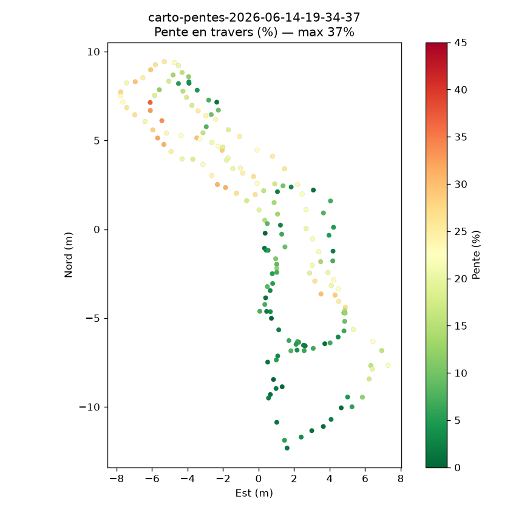

# Pentes du jardin — aide au choix d'un robot tondeuse

**Date du relevé :** 14 juin 2026
**Objet :** caractériser les pentes du terrain pour dimensionner la capacité de franchissement d'un robot tondeuse et identifier d'éventuelles zones d'exclusion.

---

## 1. Synthèse (à retenir)

- La bande **le long de la façade nord-est de la maison** (pente orientée SW–NE) est **mesurée au sol à 25°, soit ~47 %**. **C'est l'élément qui détermine le choix.**
- Le **reste du terrain est plus doux** ; les relevés capteur y indiquent ≤ ~20 % (pente *en travers* — un **plancher**, voir réserve ci-dessous).
- **Réserve importante :** nos cartes capteur mesurent la pente *en travers* (perpendiculaire au déplacement), **toujours ≤** la pente maximale. Elles **sous-estiment** donc la pente réelle. Le long de cette façade, elles montent à 37 % alors que le sol fait **47 %** — cohérent.
- **Recommandation :** cette bande à **~47 % (25°)** dépasse la capacité de la plupart des robots tondeuses (typiquement 25–40 %). → soit un robot **à fortes pentes / roues motrices (AWD)**, soit **exclure cette bande**. Le reste du jardin est tondable par un robot standard.

---

## 2. Méthode

Relevé réalisé avec un iPhone fixé sur l'**axe de deux roues** (base ≈ 40 cm, type râteau scarificateur), promené sur le terrain. Une page web (capteurs du téléphone) enregistre en continu, ~1 point/seconde :

- la **position GPS** (trace + cap de déplacement) ;
- l'**inclinaison** mesurée par l'accéléromètre (référencée à l'horizontale par la gravité, comme un niveau).

Avec deux roues, c'est le **roulis** (basculement latéral) qui mesure de façon fiable la **pente en travers** (perpendiculaire au sens d'avance) : les deux roues forment la base de mesure. Les données sont exportées puis traitées (retrait d'un défaut de montage constant, cartographie).

**Couverture du relevé :** ~112 m parcourus, 174 points de mesure, sur une emprise d'environ 16 × 23 m. Un second relevé (parcours et montage différents) confirme les ordres de grandeur.

---

## 3. Résultats

### Distribution de la pente (en travers)

| Indicateur | Pente |
|---|---|
| Médiane (50 % du terrain en dessous) | **15 %** |
| 75ᵉ centile | 23 % |
| 90ᵉ centile | 27 % |
| 95ᵉ centile | 30 % |
| Maximum observé | 37 % |

28 points (≈ 16 %) dépassent 25 % ; 7 (≈ 4 %) dépassent 30 %.

> Ces valeurs sont des pentes *en travers* = **plancher** de la pente réelle (la pente max est supérieure, cf. §4). Relevé du 14 juin (19h34). Un second relevé (20h24, montage différent) donnait un pic isolé de 64 %, **écarté comme aberrant** car supérieur à la pente réelle mesurée au sol (47 %).

### Carte des pentes

Pente en travers (%), du vert (plat) au rouge (raide). Le **foyer raide longe la façade nord-est de la maison** (visible sur la carte interactive OSM).

*Axes en mètres (Est / Nord) autour du centre du parcours. Échelle de couleur 0–45 %. Valeurs = pente en travers (plancher).*

### Zone structurante (élément décisif)

La pente forte se situe **le long de la façade nord-est de la maison** (pente orientée SW–NE) et **conditionne à elle seule le choix** du robot :

| | |
|---|---|
| Localisation | **bande le long de la façade nord-est de la maison** (pente SW–NE, ⟂ façade) — la maison est visible sur la carte interactive OSM |
| **Pente réelle (mesure terrain)** | **25° ≈ 47 %** — valeur de référence |
| Pente *en travers* (capteur) | médiane 28 %, max 37 % — **plancher** (la mesure capteur sous-estime la pente max) |
| Étendue | bande le long de la façade, ~10–15 m |

En dehors de cette bande, le terrain est plus doux (≤ ~20 % en travers). **C'est cette bande à ~47 % qui fixe l'exigence** : capacité de franchissement du robot, ou décision de l'exclure.

---

## 4. Fiabilité et limites

**Ce qui est solide :**
- **Référence terrain** : la pente le long de la façade NE est **25° ≈ 47 %**, mesurée au sol. C'est la valeur à retenir pour le dimensionnement.
- **Cohérence capteur** : nos cartes y plafonnent à 37 % — normal, la pente *en travers* est **toujours ≤** la pente max ; nos cartes sont donc un **plancher** fiable. Cela confirme aussi que le pic de **64 %** d'un relevé est **aberrant** (supérieur à la pente réelle → contamination de mesure).
- Les fortes pentes mesurées sont **stables** (faible variabilité instantanée) et **regroupées géographiquement** → ce sont de vrais talus, pas des secousses de poussée.

**Incertitudes :**
- **Orientation du téléphone non calibrée et variable d'un relevé à l'autre.** La grandeur « roulis » mesurée dépend de la façon dont le téléphone est posé sur l'axe ; les deux relevés l'ont été différemment (l'un incliné ~23° en tangage, l'autre ~12° en roulis). Les **pics** ne sont donc pas directement comparables entre relevés (37 % vs 64 %) tant que le montage n'est pas **identique et connu**.
- La pente *en travers* dépend du **sens de passage** ; la pente *maximale toutes directions* (celle que « voit » réellement le robot) nécessite des **passages croisés** et une reconstruction dédiée.
- **Précision GPS ~8 m** : résolution spatiale grossière (zones raides situées à quelques mètres près, pas au centimètre).

**Pour fiabiliser les valeurs de pointe** (si nécessaire) : un passage avec le téléphone monté **bien d'équerre** (orientation connue) et une allure un peu plus soutenue (cap GPS exploitable), puis **post-traitement à partir des capteurs bruts** (déjà enregistrés) pour reconstruire la pente **maximale toutes directions**.

---

## 5. Conséquences pour le choix du robot

La bande le long de la façade NE est à **~47 % (25°)**. La plupart des robots tondeuses grand public sont homologués **25–40 %** ; seuls des modèles **à roues motrices (AWD)** atteignent ~45–70 %.

| Capacité de pente du robot | Adéquation au terrain |
|---|---|
| ~25–40 % (standard) | **Ne franchit pas** la bande façade NE (~47 %) → **exclusion obligatoire** de cette bande. Couvre tout le reste. |
| ~45–50 % | **Limite** sur la bande à 47 % — à valider précisément (fabricant + essai), idéalement avec une marge. |
| ~55–70 % (AWD / roues motrices) | Couvre **tout**, bande façade comprise, avec marge. |

**Décision à prendre :**
1. **Robot standard (~25–40 %) + exclusion de la bande le long de la façade NE** (fil périmétrique / zone interdite / barrière). Simple et économique ; une pente à 47 % est de toute façon délicate et peu sûre à tondre par robot.
2. **Robot AWD à fortes pentes (~55–70 %)** si l'objectif est de **tout** tondre, façade comprise — vérifier que la capacité annoncée couvre 47 % avec marge.

> Note : les capacités annoncées par les fabricants sont des **maxima ponctuels**, souvent dégradés près des bordures / sur herbe humide. Prévoir une marge ; à 47 % réels, viser nettement au-dessus (ou exclure).

---

## Annexe — correspondance pente % / degrés

| Pente | 10 % | 20 % | 30 % | 40 % | **47 %** | 60 % | 70 % |
|---|---|---|---|---|---|---|---|
| Angle | 5,7° | 11,3° | 16,7° | 21,8° | **25°** | 31,0° | 35,0° |

*Pente (%) = 100 × tan(angle). **La mesure terrain de référence est 25° = 46,6 % ≈ 47 %.** Les valeurs cartographiées sont des pentes *en travers* (plancher de la pente max).*
